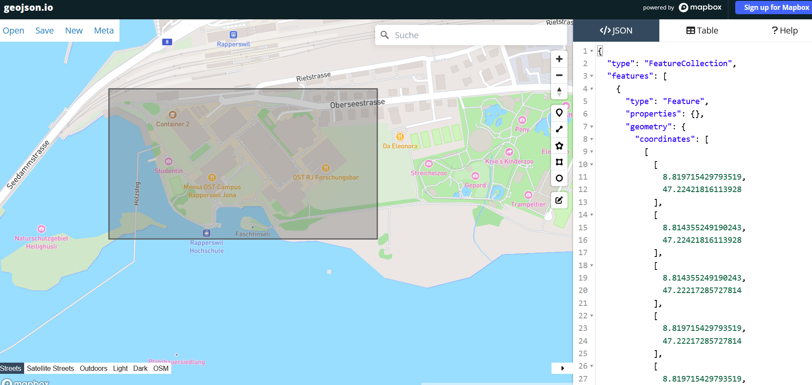

# getOSM_data_from_bbox 
Das Skript dient dazu, ein GeoJson aus einem bestimmten bereich (bbox) aus Open Street Map zu erstellen. 

## Verwendung:
1. pip install -r requirements.txt
2. [boundary.geojson](boundary.geojson) auf den Bereich anpassen, der abgefragt werden soll. (https://geojson.io)

3. Ausführen und [output.geojson](output.geojson) ist dein GeoJson.
